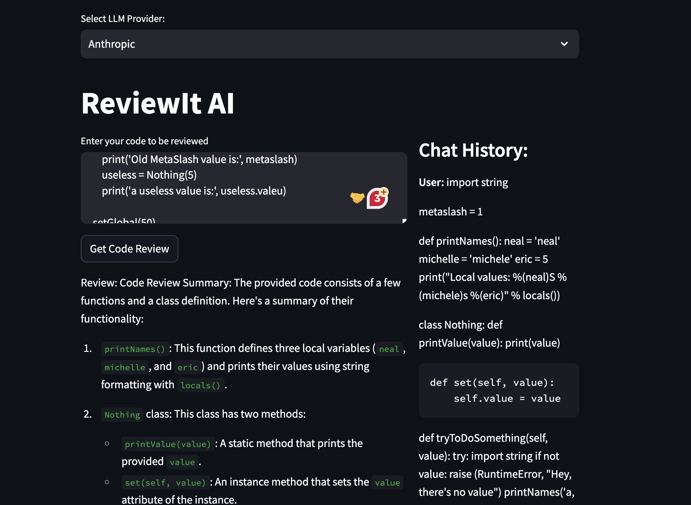

# ReviewIt AI

A code review AI assistant that suggests improvements in the provided code.

# Providers:

1. OpenAI (Model: `gpt-4-1106-preview`)
2. Anthropic (Model: `claude-3-opus-20240229`)

# How to use it?

- Clone the repository
- Create `.venv` if possible
- Install required dependencies `pip install -r requirements.txt`
- From CLI: `export OPENAI_API_KEY=sk-xxxx` if using OPENAI
- From CLI: `export ANTHROPIC_API_KEY=sk-ant-xxx` if using ANTHROPIC
- From CLI: `streamlit run main.py`

# Results:

1. Intro:

2. Code Review:

3. Anthropic Provider:

4. Non-Code:

# Next:

- Code for: [GitHub Actions](https://github.com/sachs7/reviewit-ai-git-actions)

- Code that can be improved (bad-code):
  Comment from ReviewIt-AI: [bad-code](https://github.com/sachs7/reviewit-ai-git-actions/pull/31#issuecomment-1977448710)

- Better code:
  Comment from ReviewIt-AI: [better-code](https://github.com/sachs7/reviewit-ai-git-actions/pull/32#issuecomment-1977451877)