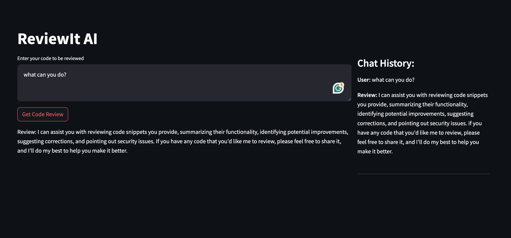
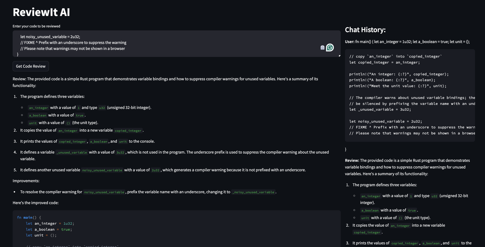
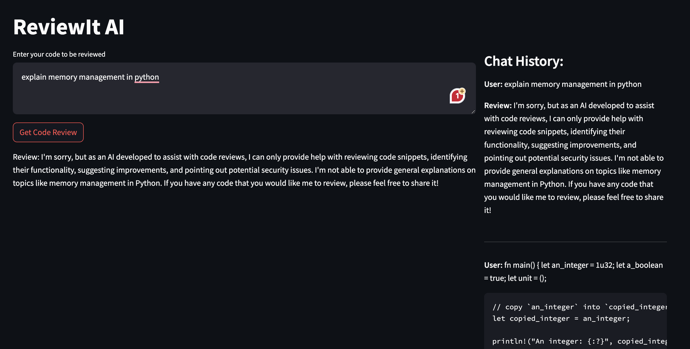

# ReviewIt AI

A code review AI bot that suggests improvements in the provided code.

# How to use it?

- Clone the repository
- Create `.venv` if possible
- Install required dependencies `pip install -r requirements.txt`
- From CLI: `export OPENAI_API_KEY=sk-xxxx`
- From CLI: `streamlit run main.py`

# Results:

1. Intro:

2. Code Review:

3. Non-Code:

# Next:

- Code for: [GitHub Actions](https://github.com/sachs7/reviewit-ai-git-actions)
  - Note: The code is working as expected, the issue is to post the comment. It will be resolved soon. Check the [sample PR result](https://github.com/sachs7/reviewit-ai-git-actions/pull/20/checks#step:5:22)
